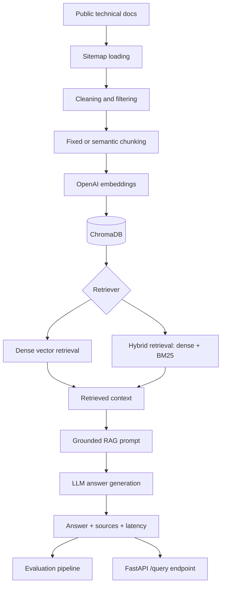
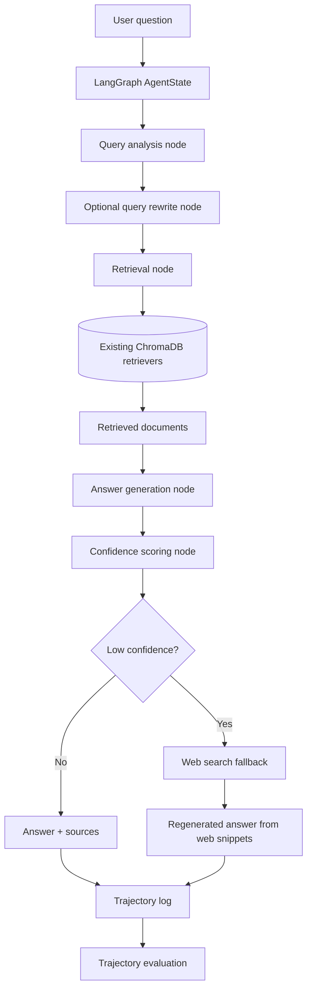
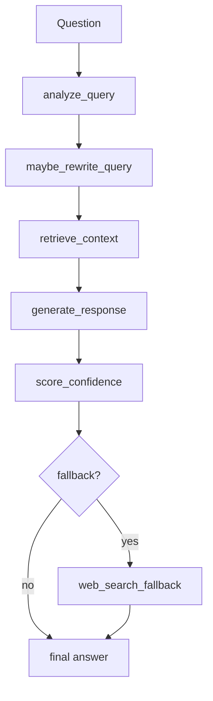
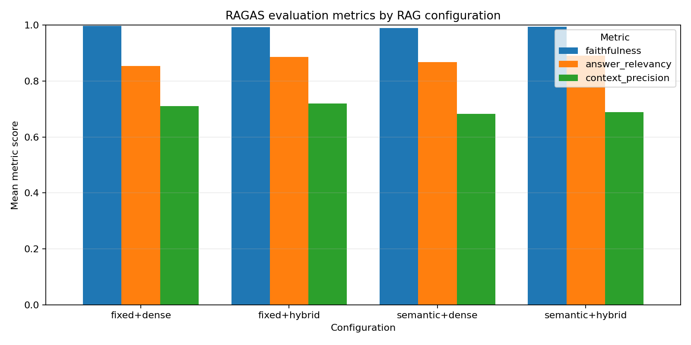

# Evaluation-First Agentic RAG with LangGraph, ChromaDB, FastAPI, and RAGAS-Inspired Evaluation

An evaluation-first Agentic RAG system built with LangGraph, ChromaDB, FastAPI, and RAGAS-inspired evaluation.

This project is designed as an AI engineering portfolio system, not a chatbot demo. It focuses on retrieval engineering, controlled agent routing, trajectory evaluation, and production-oriented design. The codebase supports a conventional RAG baseline and a minimal single-agent LangGraph workflow so answer quality and agent behavior can be measured side by side.

The system ingests public technical documentation, chunks and embeds it, stores it in ChromaDB, retrieves with dense or hybrid search, generates source-grounded answers, and evaluates both final answers and intermediate agent trajectories.

## Why This Project Matters

Modern RAG systems fail in more ways than final-answer accuracy can reveal. A system can produce a good answer with brittle retrieval, skip a needed rewrite, overuse tools, retrieve empty context, or add latency without improving quality.

This project treats those behaviors as first-class evaluation targets:

| Engineering Area | What This Project Measures |
|---|---|
| Retrieval engineering | Dense vs hybrid retrieval, chunking strategy, context precision, retrieval success |
| Answer quality | Answer relevancy, faithfulness, source-grounded generation |
| Agent routing | Query analysis, rewrite usage, retrieval decisions, step count |
| Reliability | Fallback metadata, confidence scoring, resumable evaluation |
| Production readiness | FastAPI serving, local persistence, cache-aware evaluation, structured outputs |

## Tech Stack

| Layer | Technology |
|---|---|
| Agent workflow | LangGraph |
| RAG orchestration | LangChain |
| Vector store | ChromaDB |
| Retrieval | Dense vector search, BM25 hybrid retrieval |
| Models | OpenAI generation, evaluation, and embedding models |
| Evaluation | RAGAS-compatible metrics plus LLM fallback judging |
| Serving | FastAPI |
| Analysis outputs | CSV, markdown tables, Matplotlib charts |

## Architecture

The repository contains two related systems:

1. A baseline RAG pipeline for controlled retrieval and generation benchmarking.
2. A Phase 1 agentic RAG workflow that adds query analysis, optional rewrite, confidence scoring, and trajectory logging.

### Current RAG Architecture

The baseline RAG path is intentionally direct. It is useful as a stable comparison point because every query follows the same retrieval and generation path.



### Agentic RAG Architecture

The agentic path wraps the existing retriever and generator in a minimal LangGraph state machine. It adds one conditional web-search fallback for low-confidence answers, but does not introduce code execution, MCP tools, or a supervisor-worker multi-agent design. The goal is to evaluate agent behavior without adding unnecessary orchestration complexity.



### LangGraph Workflow



### Data Flow

| Stage | Input | Processing | Output |
|---|---|---|---|
| Ingestion | Public documentation URLs | Sitemap loading, page cleaning, boilerplate filtering | Normalized document text |
| Chunking | Cleaned documents | Fixed-size or semantic chunking | LangChain `Document` chunks |
| Indexing | Document chunks | OpenAI embeddings, ChromaDB persistence | Local vector index |
| Baseline retrieval | User question | Dense or hybrid retrieval | Ranked document chunks |
| Agent query analysis | User question | Heuristic specificity analysis | Rewrite decision metadata |
| Agent rewrite | Question plus analysis | LLM rewrite when needed | Effective retrieval query |
| Generation | Question plus retrieved context | Grounded answer prompt | Answer and sources |
| Evaluation | Answers, contexts, trajectories | RAGAS-style judging and deterministic trajectory metrics | CSV and markdown summaries |

## Agent Workflow Example

Example question:

```text
What does chunk_overlap do?
```

Example trajectory:

| Step | What Happened | Why It Matters |
|---|---|---|
| 1. Query analysis | The agent inspected the question length and checked for underspecified references. | Determines whether retrieval should use the original query or a clearer rewritten query. |
| 2. Query rewrite | The agent may rewrite the question into a standalone technical query such as `What does the chunk_overlap parameter do in RecursiveCharacterTextSplitter?`. | Improves retrieval when a user query is short, ambiguous, or missing context. |
| 3. Retrieval | The agent calls the existing dense or hybrid retriever against ChromaDB. | Reuses the validated RAG retrieval layer instead of adding a separate tool stack. |
| 4. Generation | The agent passes retrieved chunks into the existing grounded RAG prompt. | Keeps answer generation constrained to retrieved context. |
| 5. Confidence scoring | The agent scores confidence using retrieved-document presence and answer uncertainty signals. | Surfaces low-confidence or no-context cases for fallback flagging and evaluation. |

The trajectory is saved as structured step data, which allows the evaluator to measure behavior such as step count, rewrite usage, retrieval success, and latency.

## Evaluation Methodology

The evaluation strategy separates answer quality from agent behavior. This distinction matters because a system can produce a plausible answer while taking inefficient or unreliable intermediate actions.

### Datasets and Configurations

The benchmark uses 42 manually reviewed documentation QA questions in
`data/eval_questions.json`. The question set is also classified in
`outputs/eval_question_classification.md`; the table below summarizes the
dataset by primary topic.

```text
50 generated questions
↓
manual review
↓
duplicate removal
↓
42 benchmark questions
```

### Evaluation Dataset Distribution

| Category | Count |
|----------|------:|
| RAG Concepts | 10 |
| Chunking | 6 |
| Retrieval | 8 |
| Embeddings | 3 |
| Vector Stores | 5 |
| Anthropic API | 10 |

The baseline evaluation compares retrieval configurations such as:

| Configuration | Purpose |
|---|---|
| `fixed+dense` | Measures standard vector retrieval over fixed chunks |
| `fixed+hybrid` | Tests whether BM25 improves keyword-sensitive technical retrieval |
| `semantic+dense` | Tests retrieval over semantically grouped chunks |
| `semantic+hybrid` | Combines semantic chunking with hybrid retrieval |

Agent trajectory evaluation compares:

| System | Description |
|---|---|
| `baseline_rag` | Direct retrieve-then-generate pipeline |
| `agentic_rag` | LangGraph workflow with query analysis, optional rewrite, retrieval, generation, and confidence scoring |

### Answer Quality Metrics

| Metric | Why It Matters | How It Is Used |
|---|---|---|
| Answer relevancy | Measures whether the answer directly addresses the user question. | Detects vague, incomplete, or off-target generations. |
| Faithfulness | Measures whether answer claims are supported by retrieved context. | Detects hallucination and unsupported synthesis. |
| Context precision | Measures whether retrieved chunks contain useful evidence. | Diagnoses retrieval quality separately from generation quality. |

RAGAS remains the preferred evaluation path. When RAGAS is unavailable in the local environment, the project uses an LLM fallback evaluator with the same metric schema so evaluation can continue reproducibly. The saved outputs do not currently record evaluator-backend metadata, so future runs should persist whether each score came from RAGAS or fallback judging.

Generation and evaluation models are configured separately through environment
variables. `OPENAI_CHAT_MODEL` is used for answer generation, query rewriting,
the API, and agent responses. `OPENAI_EVAL_MODEL` is used for LLM fallback
judging, so evaluation can run on a different model without changing the system
being evaluated. By default, `.env.example` sets
`OPENAI_CHAT_MODEL=gpt-5.5`, `OPENAI_EVAL_MODEL=gpt-5-mini`, and
`OPENAI_EMBEDDING_MODEL=text-embedding-3-small`; these values are configurable
through environment variables.

| Setting | Configuration | Used For |
|---|---|---|
| `OPENAI_CHAT_MODEL` | User-configurable OpenAI chat model | RAG answers, agent answers, query rewriting |
| `OPENAI_EVAL_MODEL` | User-configurable OpenAI evaluation model | LLM fallback judging for evaluation metrics |
| `OPENAI_EMBEDDING_MODEL` | `text-embedding-3-small` | ChromaDB document and query embeddings |

### Agent Behavior Metrics

| Metric | Why It Matters | Interpretation |
|---|---|---|
| Tool/step count | Measures workflow complexity and agent overhead. | More steps should justify their latency and quality cost. |
| Query rewrite used | Tracks whether the agent changed the retrieval query. | Useful for analyzing when rewriting helps or hurts retrieval. |
| Retrieval success proxy | Checks whether retrieval returned non-empty context. | A simple early warning for no-context failures. |
| Retrieved document count | Shows how much evidence was available to generation. | Helps explain faithfulness and answer completeness. |
| Latency | Captures retrieval, generation, and total runtime cost. | Critical for production tradeoff analysis. |
| Confidence/fallback metadata | Captures whether the agent judged the answer as low confidence. | Supports reliability analysis beyond final-answer scoring. |

In the 7-question rewrite subset evaluation, the mean agent tool step count
was 5.0, higher than the 2-3 steps expected for a clean query-rewrite-retrieve-
generate path. The observed 5.0 mean mainly reflects the fixed Phase 1 graph
design: query analysis, optional rewrite, retrieval, generation, and confidence
scoring. Confidence scoring currently runs on every query and records fallback
metadata when confidence is low; it does not trigger a second retrieval or
generation pass. A stronger next step would test whether confidence scoring
should be conditionally invoked and whether fallback thresholds correlate with
retrieval success, answer quality, and latency. See
`outputs/rewrite_subset_analysis.md` for per-question step counts and case
studies.

### Trajectory Evaluation

`scripts/run_agent_eval.py` runs the same questions through baseline RAG and agentic RAG, then writes:

| Output | Purpose |
|---|---|
| `outputs/agent_eval.csv` | Per-question comparison with answer metrics, behavior metrics, sources, latency, and trajectory steps |
| `outputs/agent_eval_partial.csv` | Checkpoint file written after every completed question for resume support |
| `outputs/agent_eval.md` | Aggregate markdown table suitable for README or reports |

Evaluation supports resumable execution. If a run stops because of rate limits,
quota errors, connection failures, or interruption, completed rows remain in
`outputs/agent_eval_partial.csv`. Restarting the same command loads the partial
CSV, skips completed questions, and continues with the remaining questions.

This makes it possible to answer questions such as:

| Evaluation Question | Metric Signal |
|---|---|
| Did the agent improve answer relevancy? | Compare `answer_relevancy` across `baseline_rag` and `agentic_rag` |
| Did the agent add latency? | Compare `total_latency_s` |
| Did query rewriting actually trigger? | Inspect `query_rewrite_used` |
| Did retrieval fail before generation? | Inspect `retrieval_success_proxy` and retrieved document count |
| Did the agent take more steps without quality gains? | Compare step count against answer metrics |

## Results

The original retrieval benchmark has been run across chunking and retrieval configurations:

| Configuration | Faithfulness | Answer Relevancy | Context Precision | Retrieval Latency (s) |
|---|---:|---:|---:|---:|
| fixed+dense | 0.998 | 0.854 | 0.710 | 0.013 |
| fixed+hybrid | 0.993 | 0.886 | 0.720 | 0.004 |
| semantic+dense | 0.990 | 0.868 | 0.682 | 0.003 |
| semantic+hybrid | 0.995 | 0.890 | 0.690 | 0.004 |

The chart below summarizes retrieval quality and latency tradeoffs across the evaluated configurations.



### Agentic RAG Comparison

#### 1. Pilot Evaluation (10 questions)

The first agentic RAG evaluation compared the baseline hybrid RAG chain against
the LangGraph agent on the first 10 evaluation questions. Query rewriting did
not trigger in this pilot, so the run primarily measures the graph wrapper,
trajectory logging, retrieval, generation, and confidence-scoring path rather
than rewrite behavior.

| Metric | Baseline RAG | Agentic RAG |
|---|---:|---:|
| Questions | 10 | 10 |
| Answer relevancy | 0.900 | 1.000 |
| Faithfulness | 1.000 | 1.000 |
| Retrieval success rate | 1.000 | 1.000 |
| Query rewrite rate | 0.000 | 0.000 |
| Mean tool step count | 2.000 | 5.000 |
| Mean total latency (s) | 5.236 | 4.392 |

The average answer relevancy improvement in this pilot is driven by one baseline
answer receiving a 0.000 relevancy score, while all other rows scored 1.000.
The lower observed agent latency should also be interpreted cautiously because
LLM latency is variable and no rewrite calls were made.

#### 2. Rewrite Subset Evaluation (7 rewrite-triggering questions)

A targeted follow-up evaluated seven questions predicted to exercise query
rewriting: 17, 18, 20, 28, 35, 37, and 41. Five of the seven actually triggered
a rewrite under the current heuristic.

| Metric | Baseline RAG | Agentic RAG |
|---|---:|---:|
| Questions | 7 | 7 |
| Actual rewrite trigger rate | 0.000 | 0.714 |
| Answer relevancy | 0.907 | 0.929 |
| Faithfulness | 1.000 | 1.000 |
| Mean tool step count | 2.000 | 5.000 |
| Mean total latency (s) | 6.037 | 7.098 |

This subset produced a small mean answer relevancy gain for the agent, but the
effect was not uniform. Rewrite helped most clearly on question 17, while
question 41 is a counterexample where the original query was already precise and
the agent scored slightly lower.

#### 3. Key Findings

| Finding | Evidence |
|---|---|
| The agentic workflow did not improve faithfulness in these runs. | Faithfulness was 1.000 for both baseline and agent in the 10-question pilot and the 7-question rewrite subset. |
| Query rewriting can improve answer relevancy for underspecified diagnostic questions. | Q17 improved from 0.350 baseline relevancy to 0.600 agent relevancy after rewrite. |
| Query rewriting did not help every question. | In the rewrite subset, Q41 scored 1.000 for baseline relevancy and 0.900 for agent relevancy. |
| The rewrite heuristic is not selective enough. | It triggered on 5/7 targeted questions, including Q41, where the original query was already well specified. |
| Agentic orchestration adds consistent workflow overhead. | The agent used 5.000 mean tool steps versus 2.000 for baseline in both evaluated samples; in the rewrite subset, mean latency increased from 6.037s to 7.098s. |

#### 4. Q17 improvement case

Q17 is the clearest positive rewrite case in the subset. The original question
was symptom-first: "My RAG answers keep cutting off mid-explanation. Could this
be a chunking problem?" The agent rewrote it as: "RAG answers cut off
mid-explanation troubleshooting chunking configuration issues." This shifted
retrieval toward a more technical troubleshooting query, which produced a higher
judged answer relevancy score: 0.350 for baseline versus 0.600 for the agent, a
71% relative gain, while faithfulness remained 1.000 for both. This should not be
interpreted as proving that chunking was not involved; rather, it shows that
query rewriting changed the retrieval direction and produced a more relevant
judged answer in this case.

#### 5. Limitations

These results should be treated as small-sample evidence rather than a broad
claim that agentic RAG is generally superior. The 10-question pilot did not
exercise query rewriting at all, and the 7-question rewrite subset was selected
because rewrite was expected to matter. LLM judge scores can vary, so small
differences such as the Q41 1.000 vs 0.900 relevancy gap should be interpreted
as inconclusive unless replicated. The current rewrite heuristic relies on token
count and vague-reference detection, which can fire on already precise questions
that happen to contain pronouns. A stronger next step would evaluate a larger
stratified sample and replace the heuristic with a confidence signal that
distinguishes genuinely ambiguous diagnostic queries from well-specified ones.

### Current Findings

| Finding | Evidence |
|---|---|
| Hybrid retrieval improves answer relevancy over dense-only retrieval. | `fixed+hybrid` and `semantic+hybrid` outperform dense variants on answer relevancy. |
| Context precision is a stronger differentiator than faithfulness in this benchmark. | Faithfulness scores saturate near 1.0, while context precision varies more across configurations. |
| Semantic chunking is not automatically better. | Semantic configurations did not improve context precision in the current results. |
| Agentic behavior requires separate evaluation. | Step count, rewrite usage, retrieval success, and latency are not captured by final-answer metrics alone. |
| Agent query rewriting can help diagnostic, symptom-first questions. | Q17: baseline relevancy 0.350 vs agent 0.600 (+71%) on "My RAG answers keep cutting off." Rewriting shifted retrieval from a symptom-framed query toward technical troubleshooting content. Inconclusive or no benefit observed on already well-specified questions. |

For design decisions, experiment analysis, and result interpretation, see [WRITEUP.md](WRITEUP.md).

## Features

| Feature | Status |
|---|---|
| Sitemap-based documentation ingestion | Implemented |
| Fixed and semantic chunking | Implemented |
| OpenAI embeddings with ChromaDB persistence | Implemented |
| Dense retrieval | Implemented |
| Hybrid dense + BM25 retrieval | Implemented |
| Source-grounded answer generation | Implemented |
| RAGAS-style answer evaluation | Implemented |
| Resumable evaluation checkpoints | Implemented |
| FastAPI `/query` endpoint | Implemented |
| LangGraph single-agent RAG workflow | Implemented |
| Trajectory evaluation | Implemented |
| Multi-agent supervisor-worker routing | Not included in Phase 1 |
| Conditional web-search fallback | Implemented |
| Code execution, MCP tools | Not included in Phase 1 |

`src/agent/tools.py` contains internal wrappers around the existing document
retriever, query rewriter, and grounded answer generator used by the LangGraph
workflow. Low-confidence answers can route once to a Tavily web-search fallback;
the workflow does not implement code execution, MCP integrations, or external
tool routing beyond that bounded fallback.

## How To Run

Set up the environment:

```bash
python -m venv .venv
source .venv/bin/activate
pip install -r requirements.txt

cp .env.example .env
```

Add your OpenAI API key to `.env`, then set `OPENAI_CHAT_MODEL` and
`OPENAI_EVAL_MODEL` to OpenAI model IDs available to your account. Keeping these
separate lets you use one model for generation and a different model for
fallback evaluation judging.

Ingest documentation with both chunking strategies:

```bash
python scripts/ingest_docs.py --source sitemap --limit 50 --chunking fixed --reset
python scripts/ingest_docs.py --source sitemap --limit 50 --chunking semantic
```

Ask a baseline RAG question:

```bash
python scripts/ask.py --retriever hybrid --debug "What does chunk_overlap do?"
```

Run the agentic RAG workflow:

```bash
python scripts/run_agent.py --retriever hybrid --trajectory "What does chunk_overlap do?"
```

Compare baseline RAG with the agentic workflow:

```bash
python scripts/run_agent_eval.py --retriever hybrid --limit 5
```

Run the full retrieval benchmark and generate the chart:

```bash
python scripts/run_eval.py --configs all
python scripts/plot_eval_results.py
```

Run the API:

```bash
uvicorn src.api:app --reload
```

## API Usage

Interactive Swagger UI is available at `http://127.0.0.1:8000/docs`.

```bash
curl -X POST http://127.0.0.1:8000/query \
  -H "Content-Type: application/json" \
  -d '{"question": "What does chunk_overlap do?", "retriever": "hybrid", "chunking": "fixed"}'
```

Response fields:

| Field | Description |
|---|---|
| `answer` | Source-grounded generated answer |
| `sources` | Unique source URLs from retrieved documents |
| `retrieval_latency_s` | Time spent retrieving context |
| `generation_latency_s` | Time spent generating the answer |
| `total_latency_s` | End-to-end request latency |

## Project Structure

```text
docqa-rag-eval/
  README.md
  requirements.txt
  .env.example
  src/
    api.py
    agent/
      graph.py
      nodes.py
      prompts.py
      state.py
      tools.py
    eval/
      trajectory.py
    chunking.py
    config.py
    evaluation.py
    loaders.py
    rag_chain.py
    vectorstore.py
  scripts/
    ask.py
    generate_eval_questions.py
    ingest_docs.py
    plot_eval_results.py
    run_agent.py
    run_agent_eval.py
    run_eval.py
  data/
    eval_questions.json
    eval_questions_raw.json
    eval_questions_review.md
  outputs/
    eval_results.csv
    eval_results_partial.csv
    eval_metrics.png
    agent_eval.csv
    agent_eval.md
    agent_eval_partial.csv
    rewrite_subset_eval.csv
    rewrite_subset_analysis.md
    eval_question_classification.md
```

`outputs/eval_question_classification.md` is a static analysis of the 42
evaluation questions. It labels likely rewrite triggers, broad question types,
and questions expected to benefit from agent behavior; it is used to explain why
the 7-question rewrite subset was selected.

## Limitations

| Limitation | Notes |
|---|---|
| Corpus size | The corpus is limited to selected public documentation pages. |
| Evaluation judge | The LLM fallback evaluator is useful but not a perfect substitute for human review. |
| Reranking | No cross-encoder or LLM reranker is included yet. |
| Agent scope | Phase 1 intentionally avoids multi-agent supervisor-worker routing. |
| Confidence and fallback calibration | Confidence scoring currently runs as a fixed final graph node and only records fallback metadata; future work should test whether it should be conditional and whether fallback thresholds are useful. |
| Serving hardening | The FastAPI app does not include production authentication, authorization, or rate limiting. |

## Future Work

| Priority | Improvement |
|---|---|
| Retrieval | Add reranking and evaluate whether it improves context precision. |
| Evaluation | Add recall@k, hit@k, and trajectory regression tests. |
| Agent calibration | Test whether confidence scoring should be conditionally invoked, and compare fallback threshold values against retrieval-success signals, answer quality, and latency. |
| Observability | Add LangSmith tracing for graph-level inspection. |
| Serving | Add production authentication, rate limits, and deployment configuration. |
| Agent design | Explore multi-step retrieval only after Phase 1 behavior is measured. |
